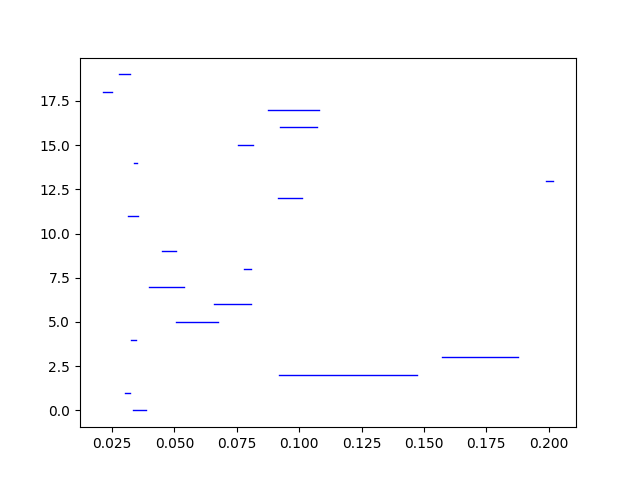
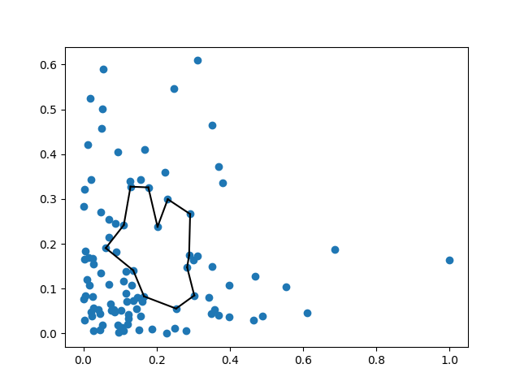

# Optimal cycle representatives

This is a rust library for computing optimal cycle representatives using an optimizer called Gurobi. To visualize the result produced by this repository, you may use another repository that we built: https://github.com/qzhang1229/optimal_reps_visualization.

# User guide
To use this github repository, you first need to download the code to your computer. You can do that by clicking on the green "code" button and choose "Download ZIP". Unzip the downloaded zip file. Then, you need to install three dependencies: Rust, Exhact and Gurobi. Below we give some instructions on how to install these dependencies.

<!--- 
## Installing CBC
`brew tap coin-or-tools/coinorbrew`

`install coin-or-tools/coinor/cbc`

https://github.com/coin-or/Cbc
--->

## Install Rust

### Windows

Go to https://www.rust-lang.org/learn/get-started. Download the correct version of the installer for your computer. Run the installer and follow the onscreen instructions. You may need to install the Visual Studio C++ Build tools when prompted to do so.

### Mac 

Open the terminal and run the following command: `curl –proto ‘=https’ –tlsv1.2 -sSf https://sh.rustup.rs | sh`. After running the command, you need to follow the prompts in the terminal to finish the installing process. 

## Install Exhact

Go to https://github.com/UDATG/exhact_rust/tree/devel_haibin_comments. Download the code by clicking on the green "code" button and choose "Download ZIP". Unzip the downloaded zip file. Then, open the Cargo.toml file contained in the root folder of optimal_reps. In that file, you can find a line that looks like 
`exhact = {path="C:\\Users\\26389\\github\\exhact_project\\exhact_rust"}`. Change the content inside the curly brackets to the absolute path of the father folder of all the code of https://github.com/UDATG/exhact_rust/tree/devel_haibin_comments. This folder should be contained inside the folder that you just unzipped. Notice that for Windows user, you need to use `\\` when writing the absolute path. 


## Install Gurobi

Gurobi provides us with a powerful optimizer and it's free for individual academic users. We will go through the process of installing it for academic users (with an academic email). For non-academic user or agency, you can refer to instructions on https://www.gurobi.com/ about how to install it. 


### Windows

Go to https://www.gurobi.com/account/. Create an account using your academic email. Login using the account you just created. Then, go to https://www.gurobi.com/academia/academic-program-and-licenses/ and follow the instructions for inividual academic license. By following the instruction, you will download the installer of gurobi optimizer, install the gurobi optimizer using the installer and install an individual academic license on your computer. 

Now, you need to add both the gurobi optimizer and the license to the environment variable of Windows so that it can be used in the rust program. To do that, you can enter "edit system environment variables" to the search bar on the bottom left of the Windows desktop. A small window will pop up and you need to click on the button "environment variables". Now, you need to create two new system environment variables. One should be called "GUROBI_HOME" and its value should be the absolute path where you installed gurobi, e.g. `C:\gurobi912\win64`. The other should be called "GRB_LICENSE_FILE" and its value should be the absolute path where you installed the gurobi license, e.g. `c:\gurobi912\gurobi.lic`. 


### Mac

To install Gurobi on a Mac, you generally follow the same procedure as to install it on a Windows. You need to download the gurobi optimizer and the license by following instructions at https://www.gurobi.com/academia/academic-program-and-licenses/. After you download and install these two things, you need to add them to the system environment variables of your computer. Below are some instructions for you to do that:

* make sure you do not move the gurobi license file from the place it's first saved to
* you'll need to set some "environmental variables"
	
	1. we will do this by modifying a `.bash_profile` folder 
		* there are several other files you can modify to update an environmental variable, each with different effects (a few examples of such files include `/.bashrc`, `/etc/profile`, `~/.profile`, `~/.zprofile`)
			* here are some partially overlapping online resources:
				* for Mac OS  [here](https://youngstone89.medium.com/setting-up-environment-variables-in-mac-os-28e5941c771c) 
				* for Mac, Linux, and Windows: [a nice discussion](https://gist.github.com/nex3/c395b2f8fd4b02068be37c961301caa7), 
				* for `bash`, `zsh`, or `tcsh`  [a nice stack exchange](ttps://unix.stackexchange.com/questions/21598/how-do-i-set-a-user-environment-variable-permanently-not-session)

    2. check to see if you have a file `/.bash_profile`
        a. You may have hit "Command + Shift + ." to show hidden files
        b. If you don't already have a `.bash_profile` file, then create one with a code editor like atom, sublime, vim, etc.
    3. add the following lines to your `.bash_profile` file:
    
        ```
        # Environmental variables for Gurobi
        export GRB_LICENSE_FILE="path/to/gurobi.lic" # the license file
        export GUROBI_HOME="path/to/installation/folder" 
        ```
    4. open a terminal and run
    
        ```
        source ~/.bash_profile
        ```
       to refresh your environmental variables with the new addition
    5. run
    
       ```
       printenv
       ```
       to double check that the new variables have been added

#### Set System Environment Variable
1. Build a plist file (https://discussions.apple.com/thread/7814747)
2. Setup, activate and launch the plist as instructed by
      https://support.shotgunsoftware.com/hc/en-us/articles/219042108-Setting-global-environment-variables-on-OS-X
      
* The set_objective function in Gurobi doesn't seem to work. However, the function can compile without this line.

## Get a persistence barcode 

You can get a persistence barcode of a given point cloud or a distance matrix by running "simplex_bar_record.rs" under the src/bin folder of this repository. 

Step one: 

To run the code, you first need to open the file "simplex_bar_record.rs" in a text editor, such as VS code. Then, the first line of the main function should be something like `let mut f = BufReader::new(File::open("data_text\\gamma-4-dis_mat.txt").unwrap());`. Here, you'll need to change the file path to the path of the file that you'd like to open. Notice that we only support distance matrix as a valid input. Therefore, if what you have is a point cloud, you can use our code in another github repository (https://github.com/qzhang1229/optimal_reps_visualization) to help you convert a point cloud to a distance matrix. 

Step two:

Next, open a terminal, navigate to the location where this repository is saved on your computer and use the command `cargo run --bin simplex_bar_record`. The terminal will ask you for the dimension of the persistence homology. After you give an input and hit enter, it will compute the result and save it into two npy files under the folder called "simplex_bar". One of them will be "birth_time.npy" and the other will be "death_time.npy". As their names imply, they store the birth time and death time data of all the features of the given distance matrix in the given dimension. To visualize the result, you can use our code in https://github.com/qzhang1229/optimal_reps_visualization.  

## Get an optimized cycle representative

To get an optimized cycle representative, you can run our code "wrapper_gurobi.rs" under the src/bin folder of this repository. 

Step one:

It is similar to the step to get a persistence barcode. You need to open "wrapper.rs" in a text editor and change the first line of the main function so that it can open the file of your distance matrix. Also, you'll need to change line 199, which is something like `let folder_path = format!("{}{}{}{}", "/Users/26389/github/optimal_reps/",folder_name_input,"_", j);`Here, you need to change the second parameter of the "format!" function to the path where you store the "optimal_reps" repository on your computer. 

Step two:

Next, open a terminal, navigate to the location where this repository is saved on your computer and use the command `cargo run --bin wrapper_gurobi`. The terminal will ask you a list of questions. First, you need to set the dimension of the persistence homology. Then, it will ask "are you going to use the edge loss method? (y/n)". If you say no, it will choose the triangle loss method. Next, it will ask whether the coefficients need to be integers and whether the weight mehod is uniform. Then, it will ask you to give a name to the folder that will store the final result. Finally, it will ask you to input the index of the cycle that you'd like to optimize. (The index can be inferred from the visualization of the barcode in https://github.com/qzhang1229/optimal_reps_visualization.) Then, the result will be saved in the folder that you just gave name to. There are two npy files. One stores the coefficients of the result and the other stores the vertices. To visualize the vertices, you can use our code in https://github.com/qzhang1229/optimal_reps_visualization.

# Example 

In order to show you how our program work to generate simplex barcode and optimize cycle representatives, I will run an example. You may follow a similar pipeline to optimize cycles in your own data set. 

## Convert point cloud to distance matrix

The point cloud we use in this example is called [2x100-Gamma-4.csv.txt](data_text/point_cloud/2x100-Gamma-4.csv.txt). The first step is to convert this point cloud to a distance matrix because the rust program can only accept a distance matrix as a valid input. To do this step, you can use a python program called point_cloud_to_distance_matrix.py in https://github.com/qzhang1229/optimal_reps_visualization. For more instructions about using this file, you can read the readme file of https://github.com/qzhang1229/optimal_reps_visualization. After running the program, a distance matrix will be recorded in a txt file. In this example, the file is named as gamma-4-dis_mat.txt and put under the folder data_text. 

## Get the simplex barcode

To get a simplex barcode, we need to run the file simplex_bar_record.rs. Before running the file, you might need to change the first line of the main function so that it could open the correct file. In this example, the first line of the main function should be `let mut f = BufReader::new(File::open("data_text\\gamma-4-dis_mat.txt").unwrap());`. To run the file, use the command `cargo run --bin simplex_bar_record` in a terminal. The terminal will ask you for the dimension of the persistent homology. Then, the result is saved into two npy files under the folder simplex_bar of this repository. To visualize the result, you can use the python file simplex_barcode_visualization.py in https://github.com/qzhang1229/optimal_reps_visualization. For more instructions, refer to the readme file of that repository. In our example, the simplex barcode for dimension 1 persistent homology should look like this: 




## Optimize a cycle representative

From the visualization of the barcode, we can find the index of any cycle that we are interested in and plan to optimize. For example, in the barcode above, we could see that the third cycle (with index 2) has the longest lifespan. Therefore, let's try to optimize this cycle and visualize the final result. In order to optimize the cycle, you need to run the file wrapper_gurobi.rs. Before running this file, you might also need to change the first line of the main function of wrapper_gurobi.rs so that it can open the correct file. In this example, it should be `let mut f = BufReader::new(File::open("data_text/gamma-4-dis_mat.txt").unwrap());`. Also, you need to change line 199, a line that looks like `let folder_path = format!("{}{}{}{}", "/Users/26389/github/optimal_reps/",folder_name_input,"_", j);`. Here, change the second parameter of the "format!" function to the path where this repository is saved on your computer.

Now, you can run the file using the command `cargo run --bin wrapper_gurobi`. The terminal will ask you a series of questions to set the necessary parameters. In this example, I tried to optimize the third cycle (with index 2) using triangle method with uniform weight and non-integer coefficients in dimension 1 persistent homology, so I answered all the questions in the terminal accordingly. The result will be stored in a folder that you just gave name to. Then, to visualize the result, you need to copy and paste the folder that contains the result to the [visualization repository](https://github.com/qzhang1229/optimal_reps_visualization). By using the file optimized_cycle_visualization.py, you can see the final result of the optimized cycle. To learn how to use all the visualization python files, read the readme file of  the [visualization repository](https://github.com/qzhang1229/optimal_reps_visualization). In our example, it looks like this:




<!--- 
## Examples of homology computations

* There are example files in `src/bin`
* Suppose you want to compile and run the file `demo_rational.rs`, which lives in `src/bin`: 

    ```
    cd path/to/crate
    cargo build --bin demo_rational 
    ./target/debug/demo_rational
    ```
* Alternatively, you can do

    ```
    cd path/to/crate
    cargo run --bin demo_rational 
    ```
* If you want to compile/run a new example, say `demo_z5.rs`, then save `demo_z5.rs` to `src/bin` and follow the steps above.

## Documentation for edge_loss_gurobi.rs
 
 * This is an implementation of the edge loss method of the optimization of cycle representative. 

### functions

#### ordered_floats_nested: 
set up ordered floats 

#### ordered_floats_nested: 
set up ordered floats 

#### rational_to_float: 
convert a rational to a floats

#### getLength: 
compute the diagonal entries in the weight matrix W used in Program 15 in the paper. 

Parameters:
* simp: The simplex we are interested in
* dismat: The distance matrix we use to get the weight of the simplex

Output:
An f64 type of number that represents the weight 

#### tri_opt:
main function that optimize for a given homological feature

Parameters:
* factored_complex: The factored complex of the homology groups. It is an object defined in the exhact library.
* birth: The birth time of the cycle to be optimized. It is represented as a MatrixIndexKey, which is the representation a simplex.
* death: The death time of the cycle to be optimized. It is represented as a MatrixIndexKey, which is the representation a simplex.
* dim: The dimension of the cycle 
* is_int: The parameter that decides whether the vector should be integral coefficient or rational coefficient.
* weight: A weight function defined for the objective function.

Output:
* A hashmap representation of the optimized cycle representative. The key of the hashmap is a MatrixIndexKey. The value of the hashmap is the coefficient.

## Documentation for tri_loss_gurobi.rs

### functions 

#### ordered_floats_nested: 
set up ordered floats 

#### ordered_floats_nested: 
set up ordered floats 

#### rational_to_float: 
convert a rational to a floats

#### getArea: 
compute the diagonal entries in the weight matrix W used in Program 15 in the paper. 
* The current version uses the heron formula to compute triangle area as weight
* The input distance matrix may result in 'triangles' that violates the triangle inequality property, and thus prevents the successful use of the function. In this case, other weighting method or uniform weight should be recommended. 

Parameters:
* simp: The simplex we are interested in
* dismat: The distance matrix we use to get the weight of the simplex

Output:
An f64 type of number that represents the weight 

#### tri_opt:
main function that optimize for a given homological feature
* can choose between LP and MIP
* can choose betweenn uniform weight and non uniform weight, which is currently obtained from area 
* returns a hashmap that records edges in the optimized cycle representative and their corresponding coefficients

Parameters:
* factored_complex: The factored complex of the homology groups. It is an object defined in the exhact library.
* birth: The birth time of the cycle to be optimized. It is represented as a MatrixIndexKey, which is the representation a simplex.
* death: The death time of the cycle to be optimized. It is represented as a MatrixIndexKey, which is the representation a simplex.
* dim: The dimension of the cycle 
* is_int: The parameter that decides whether the vector should be integral coefficient or rational coefficient.
* weight: A weight function defined for the objective function.

Output:
* A hashmap representation of the optimized cycle representative. The key of the hashmap is a MatrixIndexKey. The value of the hashmap is the coefficient.

## Example for tri_opt

### MIP + uniform weight
tri_opt(true, 1, |x| 1., &factored_complex, birth, death);

### MIP +  weight by area
tri_opt(true, 1, |x| getArea(x, &dismat), &factored_complex, birth, death);

### LP + uniform weight
tri_opt(false, 1, |x| 1., &factored_complex, birth, death);

### LP +  weight by area
tri_opt(false, 1, |x| getArea(x, &dismat), &factored_complex, birth, death);

--->

